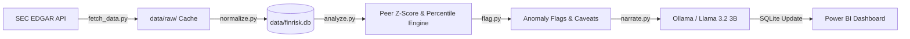

# FinRisk Engine: Financial Statement Anomaly & Risk Narrator

An AI-augmented audit analytics engine that detects statistically anomalous year-over-year (YoY) variances in public company filings, benchmarks them against industry peers using deterministic z-score modeling, and generates auditor-grade qualitative explanations using a locally-hosted LLM.

---

## Key Highlights

- **Live SEC EDGAR Ingestion**: Direct XBRL extraction via the SEC company-facts API covering 17 enterprise leaders across Retail and Tech.
- **Auditable Statistical Detection**: Anomalies are flagged through deterministic peer z-scores ($|z| \ge 2.0$) and percentile ranking. AI never decides what is anomalous.
- **Local LLM Narration**: Uses Ollama with Llama 3.2 3B running 100% locally to draft auditor notes—ensuring privacy, audit consistency, and zero API costs.
- **Accounting Nuance & Data Integrity**: Explicitly resolves XBRL tag fragmentation, shifts in GAAP reporting scope, period boundary misalignments, and low-base distortions.
- **Power BI Integration**: Outputs to a clean SQLite schema designed for interactive dashboards across drill-downs, peer benchmarks, and anomaly matrices.

---

## Project Structure

```text
.
├── pipeline/
│   ├── fetch_data.py               # SEC EDGAR XBRL ingestion
│   ├── normalize.py                # Tag harmonization & SQLite staging
│   ├── analyze.py                  # YoY % deltas & peer z-score engine
│   ├── flag.py                     # Deterministic anomaly thresholding
│   └── narrate.py                  # Local LLM auditor commentary (Ollama)
├── data/
│   ├── raw/
│   │   └── .gitkeep                # SEC EDGAR raw JSON responses (gitignored)
│   └── finrisk.db                  # Validated SQLite analytics database
├── sql/
│   ├── schema.sql                  # DDL table schemas (financials, metrics, flags, narratives)
│   └── queries.sql                 # Operational & audit validation SQL queries
├── reports/
│   └── data_summary.json           # Execution metrics & anomaly breakdown scorecard
├── utils/
│   ├── retry_narrate.py            # Re-attempts unfulfilled narrative rows
│   ├── list_flags.py               # CLI summary of flagged anomalies
│   ├── inspect_tags.py             # SEC XBRL taxonomy tag inspector
│   ├── check_msft.py               # OPEX derivation consistency validator
│   ├── debug_gaps.py               # Missing period & tag gap diagnostics
│   └── debug_api.py                # LLM connectivity test
├── .env.example                    # Environment variable template
├── .gitignore                      # Git exclusion rules (caches, virtualenvs, raw dumps)
├── LICENSE                         # MIT License
├── requirements.txt                # Python package dependencies
└── README.md                       # Project documentation
```

---

## Architecture & Flow



---

## Sample Engine Output

When the engine detects an anomaly, it produces both quantitative metrics and natural language commentary:

> **Company**: Salesforce (`CRM`) | **Fiscal Year**: 2021 | **Metric**: Net Income  
> **YoY Change**: `+3,131.7%` | **Peer Z-Score**: `2.67` *(Severity: High)* | **Flags**: `STATISTICAL`, `DISTORTION CAVEAT`  
> 
> **AI Auditor Commentary (Llama 3.2 3B)**:  
> *"Flagged YoY net income change of +3,131.7% represents a significant variance against the tech peer group (z-score: 2.67). While statistically abnormal, this item triggers a low-base distortion caveat due to near-zero prior-year net income. Evaluators should focus on the absolute dollar-level expansion rather than the headline percentage."*

---

## Core Design Principles

- **Pure Statistical Detection**: Peer z-scores and percentile ranks are calculated mathematically with documented, deterministic thresholds ($|z| \ge 2.0$).
- **AI as Explainer, Not Decision-Maker**: The LLM's only job is **narration**—contextualizing pre-flagged mathematical variances in plain English using SEC filing data. It never decides what counts as an anomaly.
- **Defensible & Auditable**: Built to institutional standards where every flagged item has a reproducible mathematical trail and XBRL tag lineage.

---

## Dataset & Scope

| Attribute | Details |
| :--- | :--- |
| **Source** | SEC EDGAR XBRL company-facts API (Live public filings) |
| **Timeframe** | FY2020 – FY2024 (spans COVID-19 structural shocks as an unassisted baseline anomaly test) |
| **Retail Peer Group (8)** | `WMT`, `TGT`, `COST`, `HD`, `LOW`, `TJX`, `BBY`, `KR` |
| **Tech Peer Group (9)** | `AAPL`, `MSFT`, `GOOGL`, `META`, `ADBE`, `CRM`, `ORCL`, `CSCO`, `INTC` |
| **Monitored Metrics** | Revenue, Net Income, Operating Expenses, Gross Profit, Total Assets |

---

## Pipeline Modules

| Step | Script | Functionality |
| :---: | :--- | :--- |
| **Ingestion** | [`pipeline/fetch_data.py`](pipeline/fetch_data.py) | Ingests company-facts JSON directly from SEC EDGAR via rate-limited API calls. |
| **Normalization** | [`pipeline/normalize.py`](pipeline/normalize.py) | Harmonizes inconsistent XBRL tags, derives GAAP metrics, validates periods, and stages to SQLite. |
| **Analysis** | [`pipeline/analyze.py`](pipeline/analyze.py) | Calculates YoY % deltas and derives industry peer z-scores and percentile ranks. |
| **Flagging** | [`pipeline/flag.py`](pipeline/flag.py) | Evaluates rule-based anomaly thresholds ($|z| \ge 2.0$) and tags low-base distortion caveats. |
| **Narration** | [`pipeline/narrate.py`](pipeline/narrate.py) | Feeds context to local Llama 3.2 3B to generate auditor-style commentary. |
| **BI** | `FinRisk.pbix` | Interactive 4-page dashboard: Overview, Company Drill-down, Peer Benchmarking, Anomalies. |

---

## Data Quality & Accounting Nuance

Real SEC filings present significant reporting inconsistencies that this pipeline explicitly accounts for:

- **XBRL Tag Fragmentation**: Companies report equivalent concepts under varied tags (e.g., `Revenues` vs. `RevenueFromContractWithCustomerExcludingAssessedTax`). Handled via hierarchical priority fallbacks.
- **Unreliable `fy` Metadata**: SEC API fiscal-year tags can misrepresent true accounting periods. Year buckets are derived strictly from the period `end` date.
- **Method-Locking per Entity**: Prevents synthetic swings (e.g., Microsoft's reported OPEX shifting scope between FY22–FY23). A single derivation formula is enforced across all 5 years per company.
- **Principled `NULL` Retention**: Undisclosed or non-derivable values (e.g., Oracle/Kroger Gross Profit) remain `NULL` rather than being fabricated.
- **Low-Base Distortion Caveats**: Flagged items with massive percentage spikes caused by near-zero prior-year bases (e.g., TJX FY2022 Net Income +3,547.8% following COVID troughs) receive a `distortion_caveat` tag instructing the LLM to prioritize dollar shifts.

---

## Quickstart Guide

### 1. Prerequisites
- Python 3.10+
- [Ollama](https://ollama.ai/) installed and running locally
- Pull the narrator model:
  ```bash
  ollama pull llama3.2:3b
  ```

### 2. Setup
Clone the repository and install dependencies:
```bash
git clone https://github.com/dhruv-rathi-tech/finrisk-engine.git
cd finrisk-engine
pip install -r requirements.txt
```

### 3. Run the Pipeline
> **Note**: Update the `USER_AGENT` variable in [`pipeline/fetch_data.py`](pipeline/fetch_data.py) with your email as mandated by SEC EDGAR fair access policy.

```bash
python pipeline/fetch_data.py      # Pull raw SEC EDGAR filings
python pipeline/normalize.py       # Standardize & load into SQLite
python pipeline/analyze.py         # Compute YoY deltas & peer z-scores
python pipeline/flag.py            # Flag statistical anomalies
python pipeline/narrate.py         # Generate LLM risk commentary
```

### 4. Interactive Power BI Dashboard
Open `FinRisk.pbix` in Power BI Desktop and point the data source connection to your local `data/finrisk.db`.

---

## License

Distributed under the [MIT License](LICENSE).